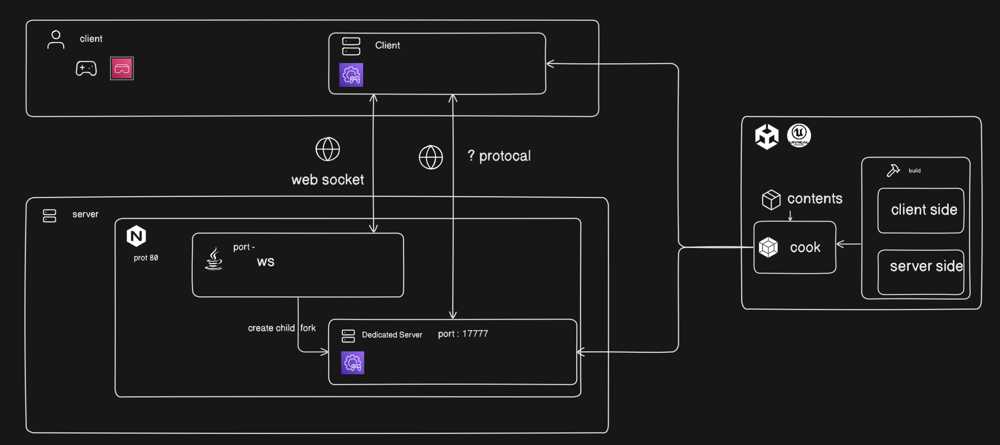
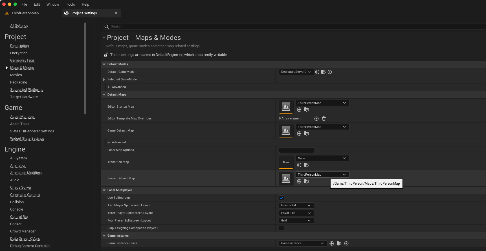
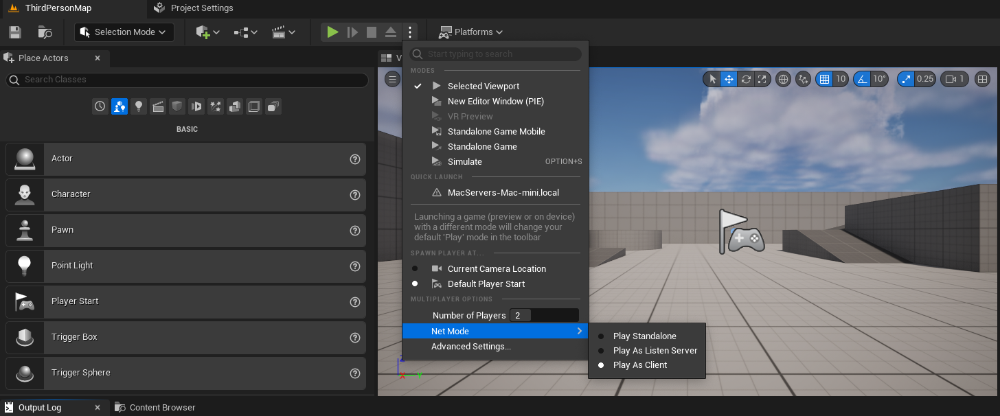
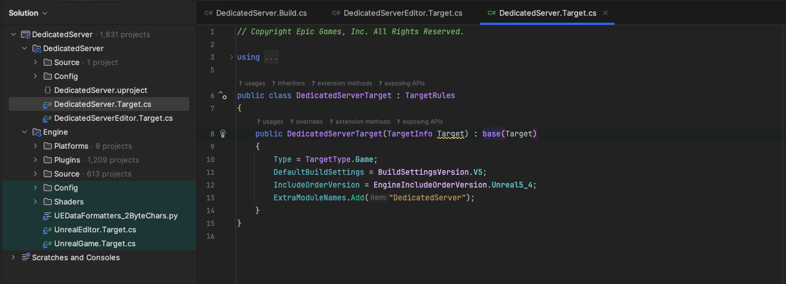
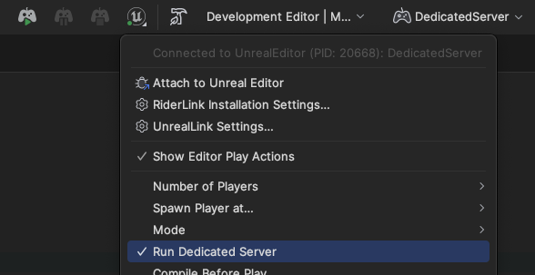
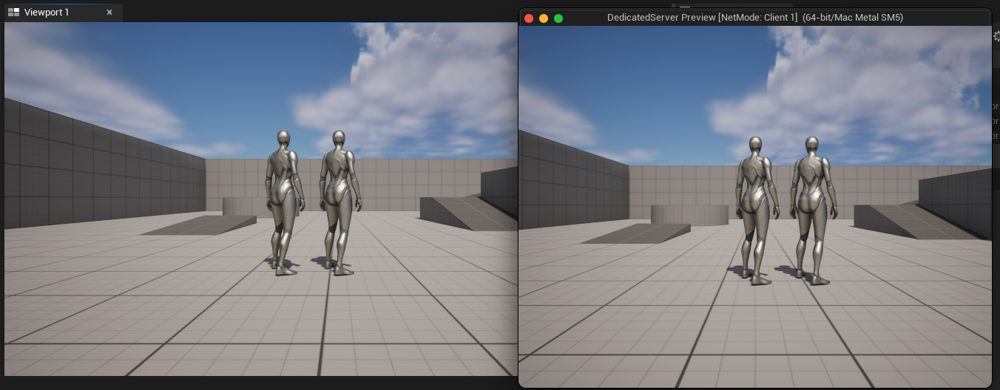
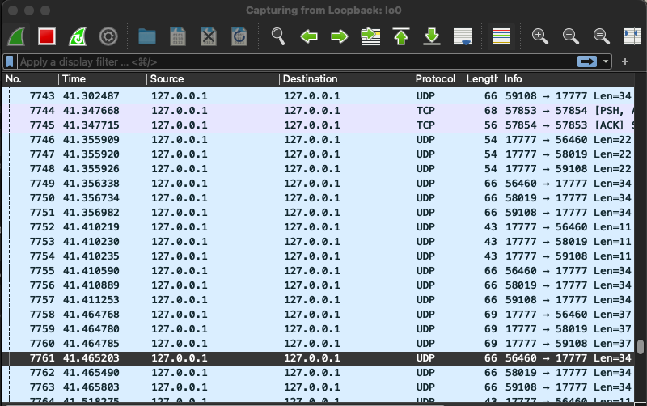

import { Callout } from 'nextra/components'

실제 서버와 통신하는 방식을 작성해 보려 한다.


| 사바 종류 | 내용 |
| --- | --- | 
| Listen Server | 클라이언트 한명이 집접 서버를 생성하여 서로 멀티플레이를 하는 방식이다 |
| Dedicated server | 외부의 서버를 타겟하여 그곳으로 접속하는 방식에 멀티플레이 이다. |

실제 사용하여 적용해보는 것을 해봐야 겟다


## 서버를 만드는 방법

의문이 드는 부분이다. 🧐\
웹을 이용한다면 ws으로 통신을 할 거같은데\
언리얼의 경우 프로젝트 안에서 서버와 클라이언트의 정의가 완성이 된다.

이로서 완성된 서버의 경우 실행을 시키면 ```localhost:7777```로 서버가 listen을 시작하는 것을 볼 수 있다.

서버를 좀더 유동적으로 제어할려면 어떻한 방법으로 할 수 있는 것인가??

### ws(websocket)?

현재까지 얻은 방법으로는 ws을 사용하여 내부 데이터를 수정하는 것이다.\
대부분의 로직은 게임엔진에서 cooking한 server를 가지고 돌아가며 이외에 로직의 경우 sw으로 통신하여 수정하는 방식을 찾았다\
간단한 구동 방식으로는 자식 프로세스로 게임엔진에서 제공하는 서버를 돌리면서 ws 서버도 돌리는 것이다.


<Callout type="info" emoji="💡">
  ```js```에서는 ```spawn()``` 으로 엔진 서버를 구동할때 사용하였다.
</Callout>

[추후 구조도 작성]

## 서버 만들기

서버를 만들어 보려한다.\
내가 공부한게 맞다면 하위 같은 구조를 가질거라고 예상을 하는데..



[언리얼 서버구성](https://dev.epicgames.com/documentation/en-us/unreal-engine/setting-up-dedicated-servers-in-unreal-engine?application_version=5.4)

상위 링크를 통하여 서버 구성하였다.

1. map 설정 서버에 디폴트 맵을 설정하였다.



2. 시작 설정에서 여러명의 플레이어와 시작 모드를 정하였다



3. 서버코드 설정





4. 멀티 플레이 체크



5. Build & Cook 

(작성중..)

6. 와이어 샤크 네트워크 확인

외부 커뮤니티를 보면 ```7777 port```로 기본 설정되있다고 하는데 나의 경우 ```17777 port```로 되어있었다.\
케릭터들을 3개까지 추가해보니 3개의 클라이언트가 서버에서 받아가는것을 확인 할 수 있었다.




## 참고

[시작해요 언리얼 | 2018 | 멀티 플레이 지원까지](https://www.youtube.com/watch?v=3j0ycrzvkB4)
[Building and Testing Dedicated Servers in Unreal Engine 5](https://www.youtube.com/watch?v=DrkG3W8a_ls&list=PLLIn4osBl0FsKVoxTF0Xi8tvO34XALuNP&index=17)
[Unreal Engine Dedicated Server Manager: From Start to Finish](https://www.youtube.com/watch?v=QHPP48Y6Gu0&t=1905s)