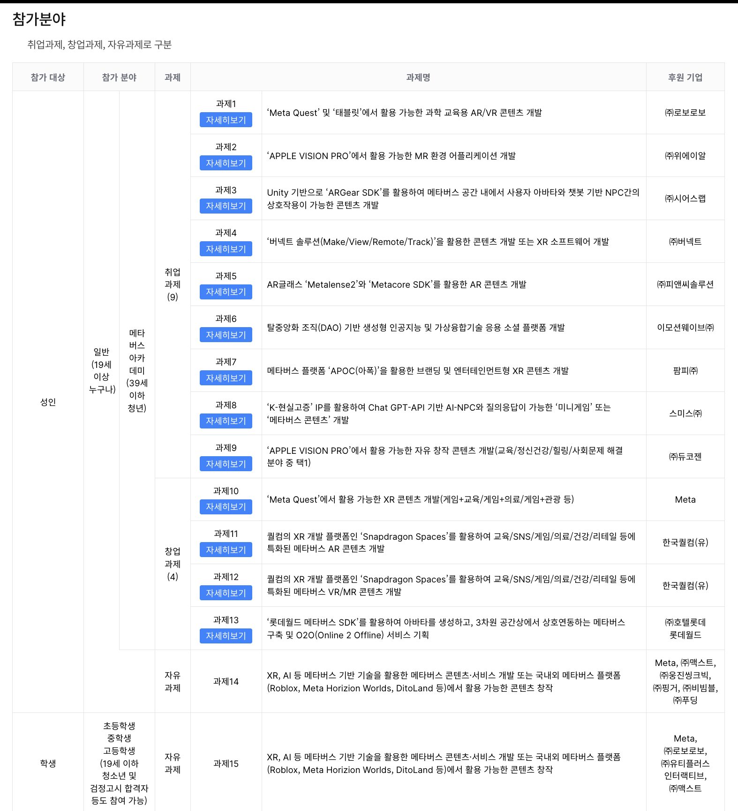
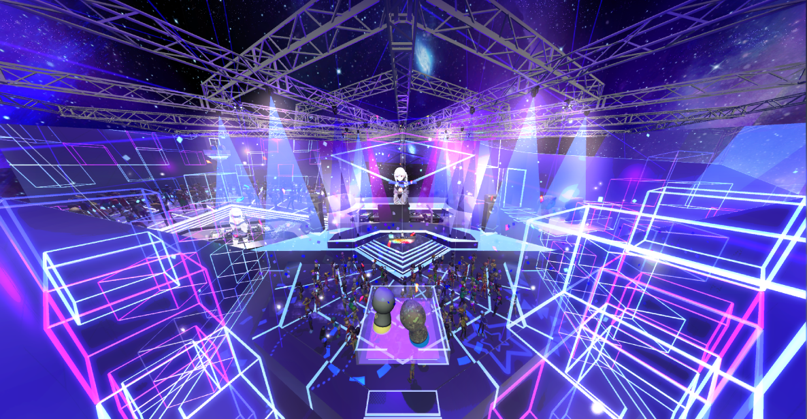
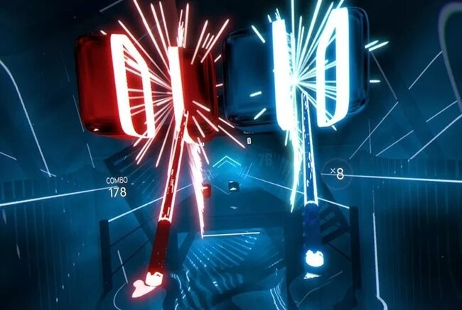
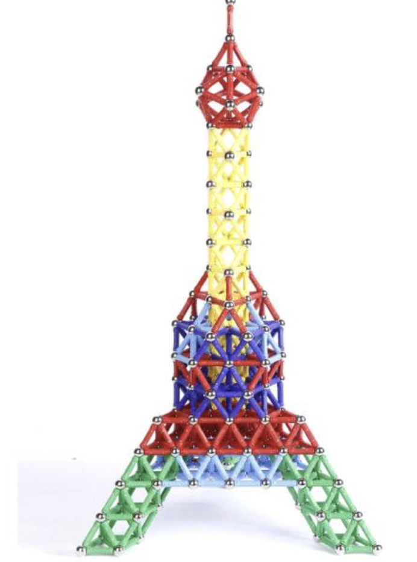
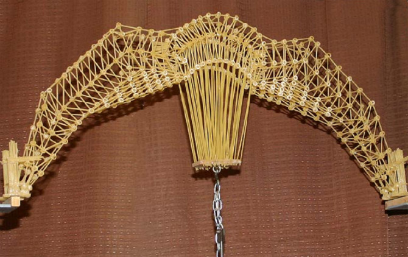
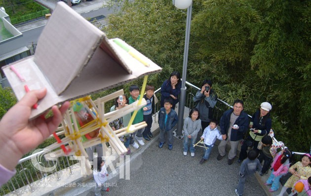
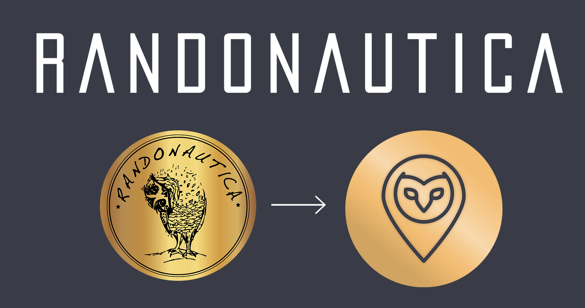
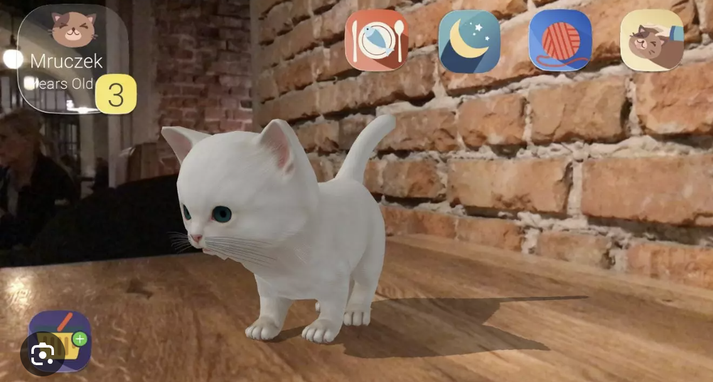

import { Callout } from 'nextra/components'
 
## 💻 첫 회의

- 2024-05-25 9시 40분 첫 회의

### 🎯 과제 정하기

처음으로 팀원들과 모여 토론을 하였다.\
참가 신청을 위한 과제 선별과 팀
주어진 과제중 팀원들과 토론 후 간추려 보았다.

또한 주어진 일정이 빠듯하기 때문에 구현 가능한 기술인지 검토를 하였고 이러한 여러가지 요소를 고려하여 한번더 회의를 진행하였다.

<Callout type="info" emoji="💡">
  과제를 정하는 조건으로 8월 7일까지 완성이 되어야 하는 기술과 구현 가능성을 검토하였다.
</Callout>

좋은 아이디어와 주제로 어느정도 틀을 정하였으며 간추린 과제와 아이디어는 다음과 같다.

#### 버츄얼 공연장

| 버츄얼 공연장 | 리듬게임 응원 |
| --- | --- |
||  |

상위 두 가지를 합쳐 공연장에 참석한 모든 이가 응원일 하면서 간단한 게임식으로 만드는 목적을 두고 있다.

과제 : 10 메타 XR

[자세한 회사 과제 소개 정보](https://www.metaversedev.kr/board_notice/show/1778e516-0b02-4183-9250-adb4eac44389?page=1)

‘Meta Quest’에서 활용 가능한 XR 콘텐츠 개발 (게임+교육/게임+의료/게임+관광 등)

필요 사항 : 메타 퀘스트 장비, 메타퀘스트 개발 방법

##### 필요 기술

| 파트 | 기술 |
| --- | --- |
| 백엔드 | 버츄얼 아이돌이 실제 공연이 가능한 RealTime 서버 |
| | 게임컨텐츠 전달 |
| | 참석 기능 |
| virtual | 게임 컨텐츠 개발 |
| | 히트 및 물리 엔진 |
| | 접속 상태 설정 |
| 디자인 | 무대 모델링 |
| | 게임 컨텐츠 모델링 |
| ai | x 추후 npc 나 ai를 만든다고 하면 필요해 보인다.(mpv에서는 실현 가능성이 없어 제외) |

#### 물리학 실험

| 물리 장난감 | 스파게티 다리 | 계란 낙하 |
| --- | --- | --- |
|  |  |  |

상위 두 가지를 합쳐 공연장에 참석한 모든 이가 응원일 하면서 간단한 게임식으로 만드는 목적을 두고 있다.

과제 : 11  퀄컴

[자세한 회사 과제 소개 정보](https://www.metaversedev.kr/board_notice/show/57d28e7f-ec7e-4e85-9e80-eb15cc613116?page=1)

과제명 : 퀄컴의 XR 개발 플랫폼인 'Snapdragon Spaces'를 활용하여 교육/SNS/게임/의료/건강/리테일 등에 특화된 메타버스 AR 콘텐츠 개발

퀄컴의 Snapdragon Spaces는 XR 기기를 기반으로 XR 메타버스 콘텐츠를 개발 및 제작할 수 있는 개방형 OpenXR기반 SDK 플랫폼임.

필요 사항 : 헤드원 xr 기기, ar 글래스 콤팩터, 스냅 드레곤 스페이스 dev kit, 스냅드레곤 SDK 학습 [링크](https://spaces.qualcomm.com/sdk/)

##### 필요 기술

| 파트 | 기술 |
| --- | --- |
| 백엔드 | 상호 작용 |
| | 게임컨텐츠 전달 |
| | 데이터 저장 |
| virtual | 게임 컨텐츠 개발 |
| | 히트 및 물리 엔진 |
| | 부서짐 구현 |
| | 컨텐츠 선택 목록 |
| 디자인 | 게임 컨텐츠 모델링 |

#### 보물찾기 팻 키우기

| 보물 찾기 | 팻 키우기 |
| --- | --- | 
|  |  |

보물 찾기와 팻을 키우는것을 융합하여 상호작용 하는 가상현실

과제 : 11  퀄컴

[자세한 회사 과제 소개 정보](https://www.metaversedev.kr/board_notice/show/57d28e7f-ec7e-4e85-9e80-eb15cc613116?page=1)

과제명 : 퀄컴의 XR 개발 플랫폼인 'Snapdragon Spaces'를 활용하여 교육/SNS/게임/의료/건강/리테일 등에 특화된 메타버스 AR 콘텐츠 개발

퀄컴의 Snapdragon Spaces는 XR 기기를 기반으로 XR 메타버스 콘텐츠를 개발 및 제작할 수 있는 개방형 OpenXR기반 SDK 플랫폼임.

필요 사항 : 헤드원 xr 기기, ar 글래스 콤팩터, 스냅 드레곤 스페이스 dev kit, 스냅드레곤 SDK 학습 [링크](https://spaces.qualcomm.com/sdk/)

##### 필요 기술

| 파트 | 기술 |
| --- | --- |
| 백엔드 | 상호 작용 |
| | 팻 데이터 기록 |
| virtual | ar 구현 |
| | 애니메이션 동작 정의 |
| | 음성 |
| 디자인 | 게임 컨텐츠 모델링 |
| | 스켈레톤 및 애니메이션 제작 |
| ai | 감정 및 분석 |

### 💡 과제 선택 결과

추후 작성 예정