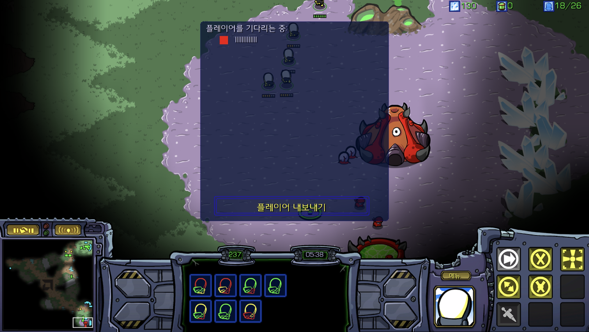
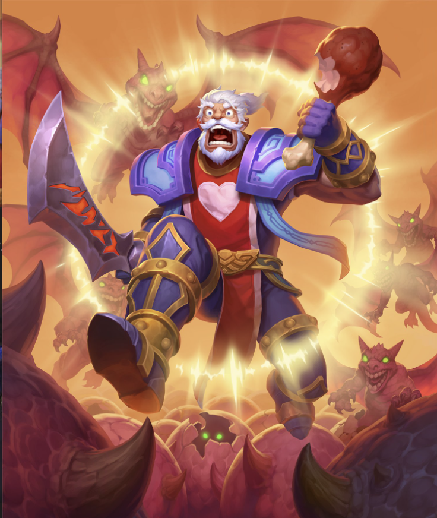

멀티 플레이 모드에는 3가지의 종류가 있다

| 종류 | 설명 |
| --- | --- |
| Standalone | 네트워크 없이 로컬에서 하는 멀티 플레이 |
| Dedicated Server | 서버가 독립적으로 호스팅 되고 있으며 클라이언트가 서버에 접속하는 방식 |
| Listen Server | 하나의 클라이언트가 서버를 같이 실행하며 다른 플레이어들의 접속을 허용하는것 |

## Listen Server

Listen Server 는 소규모 멀티플레이 게임에 적합하다.

장점 
1. 따로 호스트를 할 필요가 없다
단점
1. 서버 제공자의 기본 사양이 높아야함(네트워크, 컴퓨팅 파워 등)
2. 서버 제공자의 치팅가능성

예시로 들만한 것으로는 스타크레프트와 같은 것이 있을거 같다.

## Dedicated Server

따로 서버를 돌리고 호스팅 하는 방식이다.\
렌더링과 기타 뷰포트, 사운드에 대한 작업을 하지않기 때문에 높은 사양을 요구하지 않는다(서버측)

server 측
- level과 actor가 로드되어 있다.
- UI, VFX, Audio와 같은 플레이 할때 필요한 사항을 작업하지 않는다.

client 측
- 플레이어 관점의 viewport에 필요한 사항만 로드한다.
- level단위의 로드가 가능해진다.
- actor와 같은 오브젝트를 clone(복제)하는 것으로 현제 필요한 사항만 로드하여 최적의 환경을 만들어 준다.

또한 운영적인 측면으로 보았을때 한번의 게임 실행으로 멀티플레이가 유지된다.
- 서버 + N 개의 클라이언트가 접속 할 수 있다
- 일관성을 유지하기 위해 "shared world"(?) 가지게 된다.
- client가 server에 요청하는 식으로 권한에 따라 업데이트 할 수 있게 된다.(치팅을 방지한다)

와우, 배틀그라운드와 같은 게임을 예로들 수 있다.
| | |
| --- | --- |
| | |

## 참고
HosnestDanGames : [https://www.youtube.com/watch?v=t8Zlb2ggmt0](https://www.youtube.com/watch?v=t8Zlb2ggmt0)