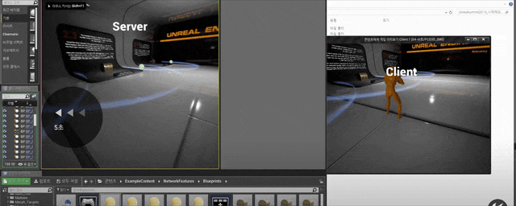

import { Callout } from 'nextra/components'

서버는 플레이어당 하나의 커넥트를 생성한다

커넥트에 대하여 다양한 Protocol 연결하는데 이러한 다양한 체널들을 연결하는 것으로 클라이언트의 정보를 송수신 할 수 있는 수단을 만든다.\
또한 어떠한 엑터가 생성되며 새로운 체널을 만드는 것으로(액터가 생성되었을때 서로의 연결을 생성하여 추측됨)서로 연결로 존재를 확인하다가\
엑터 체널을 없에는 것으로 클라이언트 측에서 사라지게 표현을 한다고 알려준다.

상위 이러한 부분들은 모두 복제된 오브젝트로 클라이언트가 표시하고 있기 때문에 실제 오브젝트의 수정을 막는것으로 느껴진다

[이부분에 대하여는 좀더 공부한다음 추가적인 지식이 있을때 작성하도록 하겠다.]

[추가적으로 구성 이미지를 만들것 ]

## Server 와 Client 사이

Replication : 클라이언트에게 복제된 데이터를 업데이트 한다
Rep Notify (OnRep) : Replication으로 데이터가 바뀌었을때 발생하는 로직을 말한다.
Remote Procedure Calls (RPC) : 네트워크를 통해 함수를 호출하는 것을 말한다 
- 서버가 클라이언트한테 시키기 (예: (server) client 너 팔들어봐)
- 클라이언트가 서버에게 시키기 (예: (client) server야 맵에 오로라 발생시켜! )
- multicast (Server to Server + Client) [아직 뭔지 모름]

### Replication

Actors에 복제할 것인지 설정할 수 있다
- 엔진에서 Replicates를 true로 설정하는 것으로 RPC를 송수신 할 수 있다. (요약 데이터 공유할 수 있다.)
서버는 지속적으로 연결되 클라이언트에게 업데이트 할게 있는지 확인한다

#### 프레임당 데이터 

프레임당 데이터를를 얼마나 보넬 것인가를 고민하여야한다
- 모든 스트럭트 데이터를 전송하는 것이 아닌 필요한 부분만 전송 하여야한다.

클라이언트는 서로 같은 프레임이 아닐 수 있다는 것을 염두하여야 한다.\
- 데이터의 송수신 순서 (어떠한 데이터가 먼저왔는지 알아야한다)
- 랜더링 속도의 차이로 프레임의 차이가 발생 할 수 있다.

특정 데이터에 좀더 많은 update
- Net Update Frequency (업데이트 빈도): 얼마나 자주 업데이트 할 것인가 (1초 100번이 디폴트)
- Net Proirity (우선순위) : 어떠한 데이터를 우선으로 업데이트 할 것인가

### Replicated Properties

게임엔진에서 모든 level과 actor를 만들고 server와 client를 build 했음으로\
서로 어떠한 데이터가 동유되고 호출 되는지 알고 있다.\
그렇기에 처음에 이러한 데이터를 세팅해 줄 필요는 없다.\
지속적으로 동일한 상테를 만들기 위해서는 특정 변화하는 속성을 복제하여 공유하는 것으로 같은 상태를 유지시키는 것이다.

### Rep Notify

어떠한 로직으로 활성화 하려면 "Replicated"가 아닌 "RepNotify" 으로 설정한다.\
클라이언트의 복제된 값을 받았을때 행동을 할 수 있도록 하는것이다

| 수신 데이터 | RepNotify 표현 |
| --- | --- |
| 공의 위치가 바뀐 값이 왓다 | 공이 바뀐 값까지 날라가는 것으로 표현한다.(공이 순간이동하지 않게) |
| 상태가 침대에 눕는 것으로 바꼇다 | 침대로 눕는 애니메이션을 실행한다 |

이러한 프레임별 부드러운 화면 효과를 보여주기 위해 사용하기도 하며\
전송하는 데이터가 적지만 효과적으로 나타넬 수도 있게 된다.

### Remote Procedure Calls (RPC)

RPC에는 3가지로 작동 방식으로 분류 하는것 같다 (확실 하지 않음)

| 작용 | 설명 |
| --- | --- |
| Run on owning client | 서버가 클라이언트의 함수를 호출하는것 |
| Run on Server |  클라이언트가 서버의 함수를 호출하는 것 |
| multicast | 서버의 함수를 실행하며 서버에 연결된 모든 클라이언트에게 작동한것을 전달하는 것 |

### Relevancy

실제 클라이언트가 특정 정보에 대하여 업데이트 받아야 하나? 에 대한 것이다.\
너무 멀거나 내 게임에 존재하지도 않는데 그것을 업데이트 할 필요는 없기 때문이다.

<Callout type="info" emoji="💡">
  unreal에 경우 NetCullDistanceSquared 로 조절을 할 수 있다고 한다.
  c++ 의경우 IsNEtRelevantFor 함수의 룰을 정이해야한다고 한다.
</Callout>

#### Entering / Leaving Relevancy

Relevancy 에는 조금 특이한 사항이 있다.\
상위에서 말한듯이 Client가 영향을 받지 않는 다면 update가 실행되지 않고 이러한 부분에 있어\
아직 업데이트를 인지하지 못한 Client가 update된 actor에 접근했을때 새로히 생성되며 반응하는 오류이다.

이러한 사항을 인지하고 변화에 인지되지 않은 오브젝트의 로직이 꺼리낌 없이 작도하도록 만들어야 한다. 

## 용어?

[VoIP](https://en.wikipedia.org/wiki/Voice_over_IP)(voice over Internet Protocol) : 음성 인터넷 Protocol 

Net Relevant : 어떠한 동작을 client 에게 보내야 할 지 검증하는 것

## 참고
HosnestDanGames : [https://www.youtube.com/watch?v=t8Zlb2ggmt0](https://www.youtube.com/watch?v=t8Zlb2ggmt0)

시작해요 언리얼 2018 : [https://www.youtube.com/watch?v=3j0ycrzvkB4](https://www.youtube.com/watch?v=3j0ycrzvkB4)