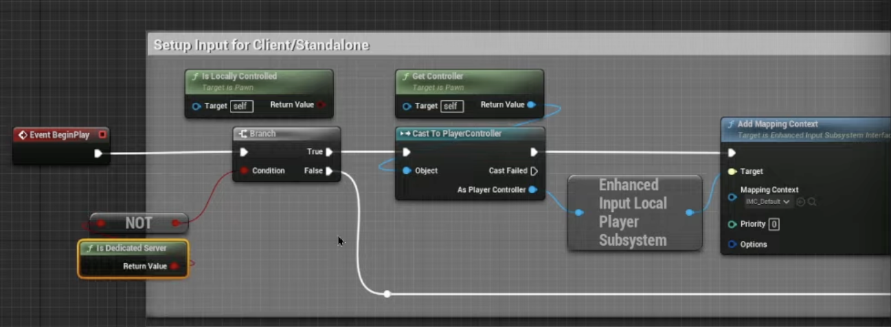
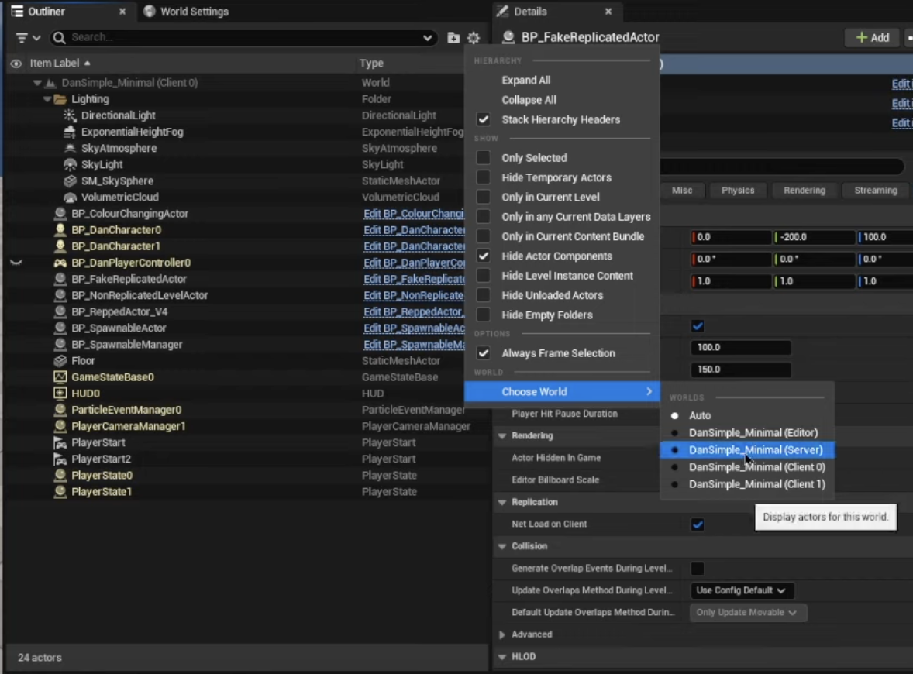

role 과 proxy에 대한 설명

제대로 이해하지 못하여 아직 작성을 못한다

간단히 이해한 바로는 role은 권한이다

RPC로 호출 할 수 있는 권한인거같다

```cpp
{
    const ENetMode NetMode = GetNetMode();

    if (NetMode == NM_Standalone)
        return true;
    if (NetMode == NM__client && GetLocalRole() == ROLE_AutonomousProxy)
        return true;
    if (GetRemoteRole() != ROLE_AutonomousProxy && GetLocalRole() == ROLE_Authority)
        return true;
}
```
상위와 같이 커스텀하여 만들수도 있고



상위와 같이 블루 프린트이 속성을 주어 설정 할 수 도 있다.

## 개인별 사용하는 오브젝트 보는 방법

하위와 같이 설정을 통해 누구의 입장에서 월드를 볼지 선택할 수 있다.

